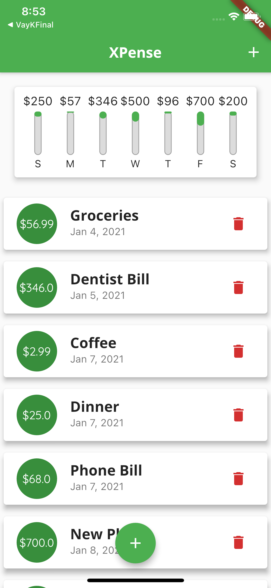

# XPense

XPense is a dual platform mobile app built using the Flutter framework. The app is compatible for IOS and Android devices. The app allows the user to track their day-to-day expenses through a clean user interface. The user can entire the title, amount, and date of their expense which is then displayed as a list item on the screen. The user can also see how their spending is spread out throughout the week using the chart feature which shows the percentage of spending on each day using an intuitive bar design. The user can also add and delete as many expenses as they like 

